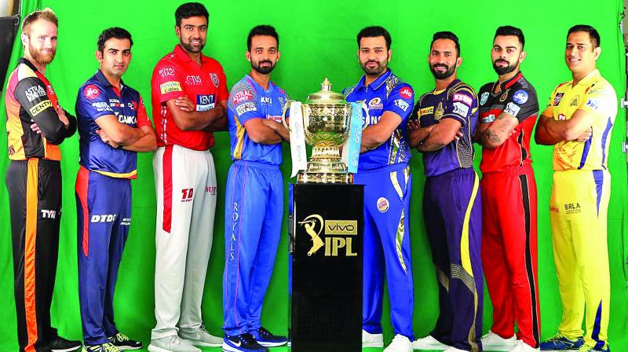
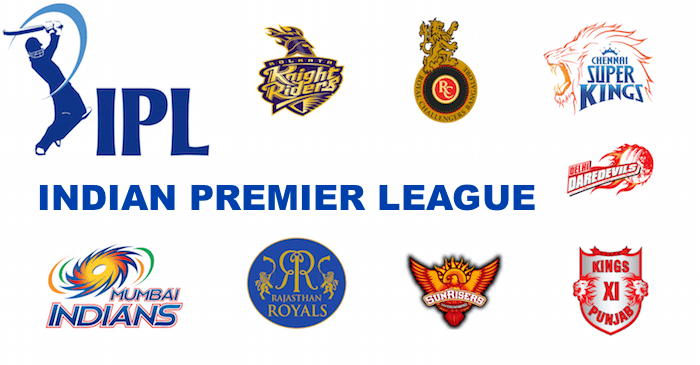
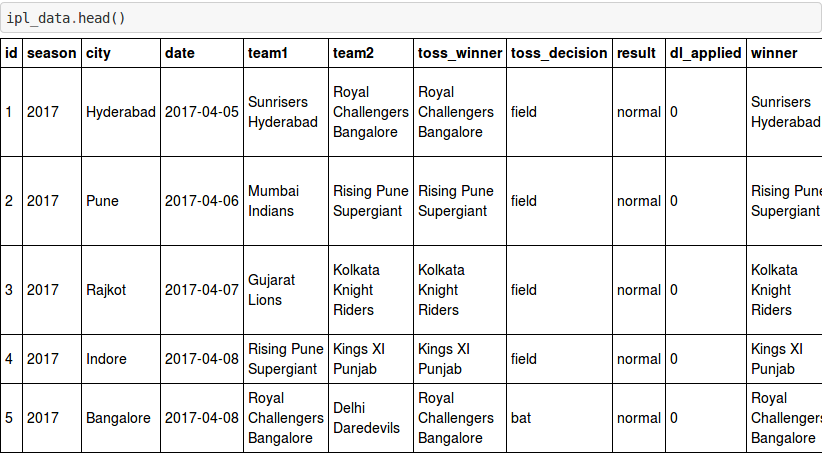
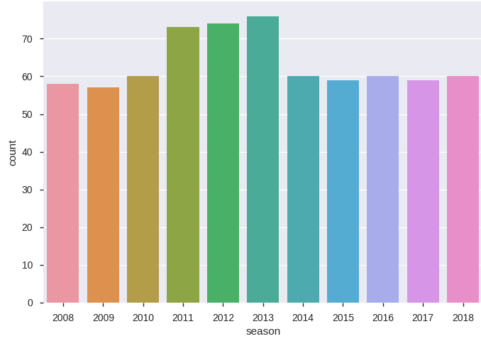
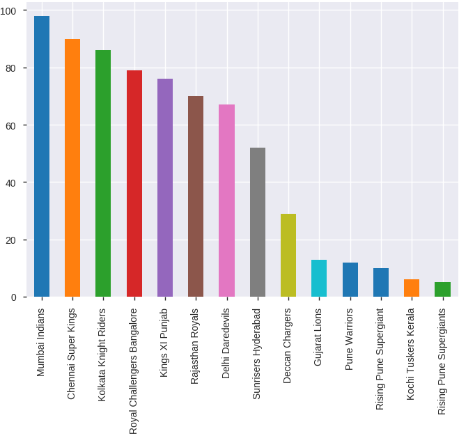

# Indian Premier League Exploratory Data Analysis

- The __Indian Premier League (IPL)__ is a professional __Twenty20 cricket league__ in __India__ contested during __March or April and May of every year__ by __eight teams__ representing __eight different cities__ in India.The league was founded by the __Board of Control for Cricket__ in India (BCCI) in __2008__, and is regarded as the brainchild of __Lalit Modi__, the __founder__ and former commissioner of the __league__.
- The __IPL__ is the __most-attended cricket league__ in the __world__ and __in 2014 ranked sixth__ by average attendance among all __sports league__.
-  In __2010__, the __IPL__ became the __first sporting event__ in the __world__ to be __broadcast__ live on __YouTube.__
- Current Champion of __IPL-2018__ is __Chennai Super Kings.__
- __IPL__ season starts from __2008__ onwards.  

## Objective 
- To find out the overall history of __Indian Premier League__.like
  - Overall Matches played
  - Overall Seasons from 2008
  - Winning team in terms of maximum runs
  - Winning team in terms of maximum wickets
  - Winning team in terms of minimum wickets
  - Number of mathces played per season
  - Most succesful IPL team
  - Particular team performance in IPL
  - Seasonwise winning team etc.
  
  ## Number of team participated in IPL
  
  
  ## DataSet Info
 - __Dataset__ contains data of all IPL matches from __2008__ season till __2018__ season.
 - __Dataset__ has __season, city, date, team1, team2, toss_winner, toss_decision, result, dl_applied, winner, win_by_runs,     win_by_wickets, player_of_match, venue, umpire1, umpire2, umpire3__.
 - Dataset comprises of __696 observations__ of __28 columns__.
  
 
 ## Way To Do Ipl EDA
- load the required packages
- reading the IPL Dataset
- Apply the statistical method to understand the data
- Apply the pandas profiling before preprocessing for better understanding of data
- Preprocessing of data
- Pandas Profiling after preprocessing
- Visualization of Data

## IPL Season Visualization

 - Now we can conclude that from the graph IPL season played from 2008 to till 2018 according to this dataset.
 - Most Number of matches played in 2013 Season.
 - Less number of matches played in 2009 Season. 
 ## IPL Team Visualization
 - According to graph,Most of the time Mumbai Indians is the match winner in whole season.
 - Rising Pune SuperGiants is a match loser. 
 
 
 ## Conclusion After EDA
- We used the __dataset__ containing __696 match data__ in order to __predict__ the outcome of the __Indian Premier League match__.
- These number of matches details were obtained after putting the dataset through cleaning and pre-processing.
- Based On these data we conclude that __Mumbai Indians__ is the the __most winning team__ in whole __IPL__.
- There have been __eleven seasons__ of the __IPL tournament__.
- The __current IPL title holder__ is the __Chennai Super Kings__, who __won__ the __2018 season__.
- The most __successful franchises__ in the tournament are the __Chennai Super Kings__ and __Mumbai Indians__ with 3 tournament wins each.
- Whoever team won the toss most probably they won the match.
- __2013 season__ had __played__ the __most number of matches__.
- Most __Successful team__ roll played as __Mumbai Indians__.

 
 ## -------------------------------------------------------------------------------------- ##

