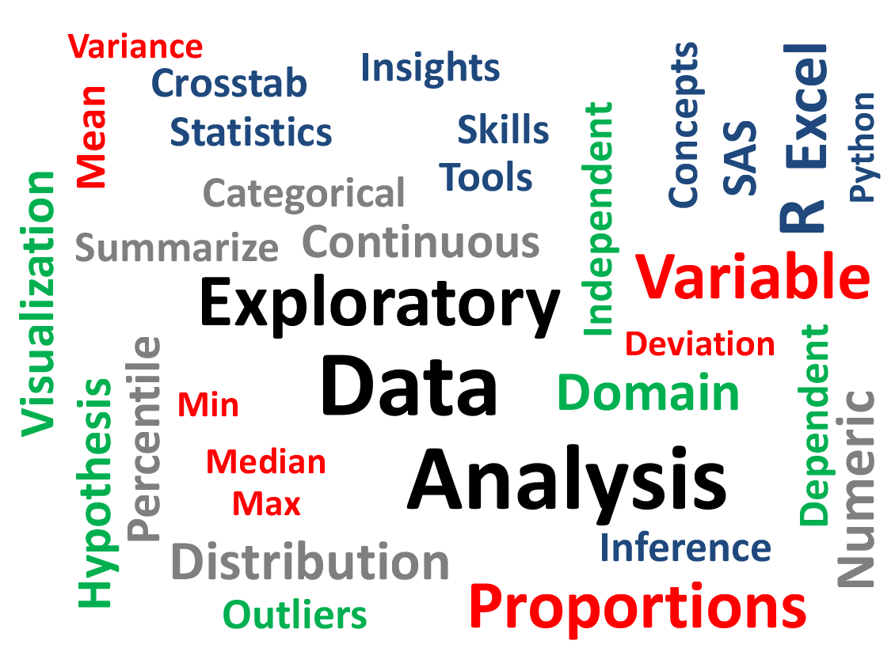
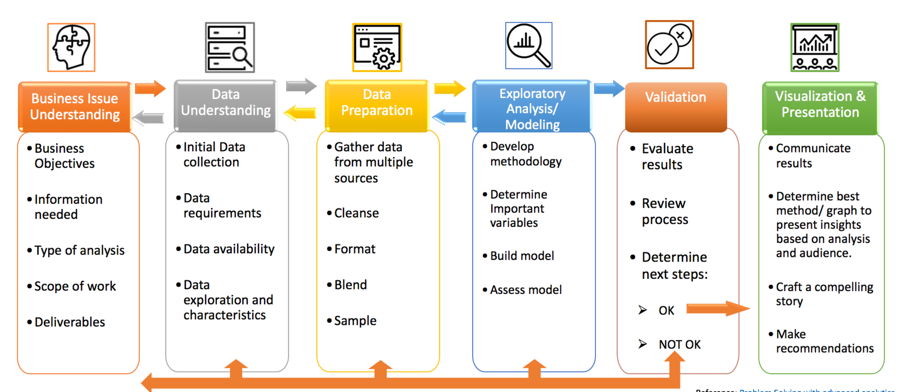
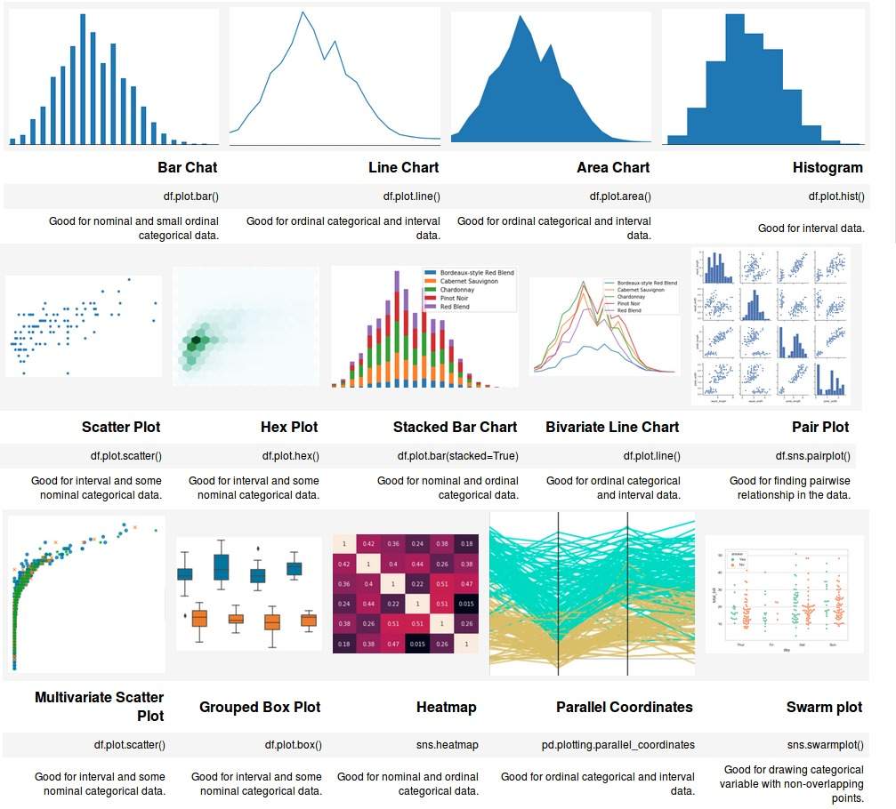

# Exploratory Data Analysis

__What does Exploratory Data Analysis really means?__ 
__Exploratory Data Analysis__ refers to the critical process of performing initial __investigations on data__ so as to discover __patterns__,to spot __anomalies__,to __test hypothesis__ and to check __assumptions__ with the help of summary __statistics and graphical representations__. 
__Which type of tasks tackle EDA?__ 
- Spotting mistakes and missing data
- Mapping out the underlying structure of the data
- Identifying the most important variables
- Listing anomalies and outliers
- Testing a hypotheses / checking assumptions related to a specific model
- Establishing a parsimonious model (one that can be used to explain the data with minimal predictor variables);
- Estimating parameters and figuring out the associated confidence intervals or margins of error. 
## Exploratory Data Analysis Process 
 
The process of __evaluating data__ using __analytical and logical reasoning__ to examine each component of the __data__ provided.
## Recomended Process for Exploratory Data Analysis.
- Look at the __structure of the data__: number of data points, __number of features__, __feature names__, __data types__, etc.
- When dealing with __multiple data sources__, check for __consistency__ across __datasets__.
- Identify what data signifies (called measures) for each of data points and be mindful while obtaining metrics.
- Calculate __key metrics__ for each __data point__ (summary analysis): 
  - a. __Measures of central tendency__ (Mean, Median, Mode)
  - b. __Measures of dispersion__ (Range, Quartile Deviation, Mean Deviation, Standard Deviation)
  - c. __Measures of skewness and kurtosis__.
- Investigate visuals: a. __Histogram__ for each variable; b. __Scatterplot__ to correlate variables.
- Calculate __metrics__ and __visuals__ per category for __categorical variables (nominal, ordinal)__.
- Identify __outliers__ and mark them. Based on context, either __discard outliers__ or analyze them separately.
- Estimate __missing points__ using data __imputation techniques__.
## Data Visualisation
 
__Data visualization__ is the __graphical representation__ of __information__ and __data__. By using __visual elements__ like __charts__, __graphs__, and __maps__, __data visualization__ tools provide an accessible way to __see__ and __understand trends__, __outliers__, and __patterns__ in __data__. 
-  one of the best ways to understand the data is visualization.
- In the __world of Big Data__, __data visualization__ tools and technologies are essential to __analyze massive amounts of information__ and make data-driven decisions. 
### What are visual aids for exploratory analysis? 
- __UniVariate Plotting__ 
  - Bar Chart
  - Line Chart
  - Area Chart
  - HistoGram
- __Bi-Variate Plotting__
  - Scatter Plot
  - Hex Plot
  - Stacked Bar Chart
  - Bi-Variate Line Chart
  - Pair Plot
- __Multi-Variate Plotting__
  - Multi-Variate Scatter Plot
  - Grouped Box Plot
  - Heap Map Plot
  - Parallel Co-Ordinates
  - Swarm Plot 
  

### Statistical AnaLysis 
__Statistical AnaLysis__ is the science of collecting, exploring and presenting large amounts of data to discover underlying patterns and trends.
__Statistical analysis can be broken down into five discrete steps, as follows__
- Describe the __nature of the data__ to be analyzed
- Explore the __relation of the data__ to the underlying population.
- Create a __model__ to summarize understanding of how the data relates to the underlying population.
- Prove (or disprove) the __validity of the model__.
- Employ __predictive analytics__ to run scenarios that will help guide future actions. 
 
## Repository Overview
This repository is about Exploratory Data Analysis approaches as per the industry practices.

## Table of Contents
- [Titanic Exploratory Data Analysis](#section1) 
- [IPL Exploratory Data Analysis](#section2) 

___

### [Titanic Exploratory Data Analysis](./Titanic)
  
- The sinking of the __RMS Titanic__ is one of the most infamous __shipwrecks in history__.  On __April 15, 1912__, during her maiden voyage, the __Titanic sank__ after __colliding__ with an __iceberg__, __killing 1502 out of 2224 passengers and crew__. 
- One of the reasons that the __shipwreck__ led to such __loss of life__ was that there were __not enough lifeboats__ for the __passengers and crew__. Although there was some eement of luck involved in surviving the sinking, some groups of people were __more likely to survive__ than others, such as __women, children__, and the __upper-class__. 
- In this challenge, we will do the complete the __analysis__ of what __sorts of people__ were likely to __survive__. 
___

### [Titanic Exploratory Data Analysis](./Ipl)
  
- The __Indian Premier League (IPL)__ is a professional __Twenty20 cricket__ league in __India__ contested during __March or April and May__ of every year by __eight teams__ representing eight different cities in __India__.
- The __league__ was __founded__ by the __Board of Control for Cricket in India (BCCI)__ in __2008__, and is regarded as the brainchild of __Lalit Modi__, the __founder__ and former commissioner of the __league__.
- The objective of the __Exploratory Data Analysis__ is to try and __analyze__ Indian Premier League __data__. 

