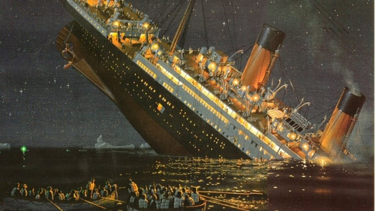

# Titanic Exploratory Data Analysis  
 
## Description & DataSet Info 
- The sinking of the __RMS Titanic__ is one of the most infamous __shipwrecks__ in history.  On __April 15, 1912__, during her maiden voyage, the Titanic sank after colliding with an iceberg, __killing 1502 out of 2224 passengers and crew__. This sensational tragedy shocked the international community and led to better safety regulations for ships.
- Resulted in the __deaths__ of __more than 1,500 people__, making it one of __history's deadliest marine disasters__ during peacetime.
- One of the reasons that the __shipwreck__ led to such loss of life was that there were __not enough lifeboats for the passengers and crew__.
- Some groups of people were more likely to survive than others, such as __women__, __children__, and the __upper-class__.
__
- This __dataset__ consists of the __information__ about people boarding the famous __RMS Titanic__. Various variables present in the __dataset__ includes __data of age__, __sex__, __fare__, __ticket__ etc.
- The dataset comprises of __891 observations of 12 columns__. 
## Objective
 
- Our objectives is to analyze the what sorts of people were likely to survived or died.

