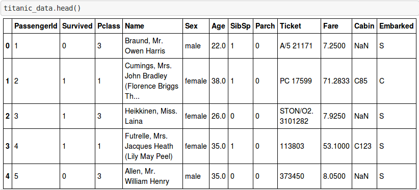
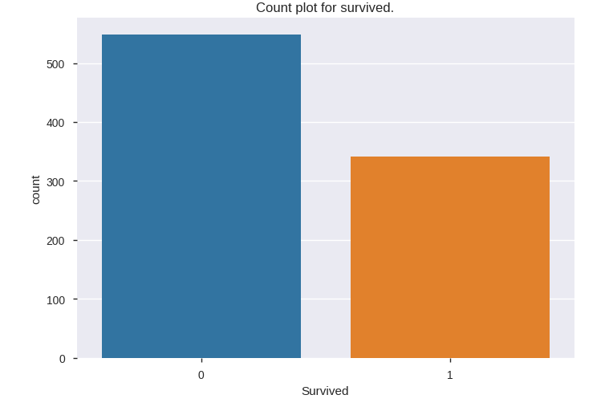
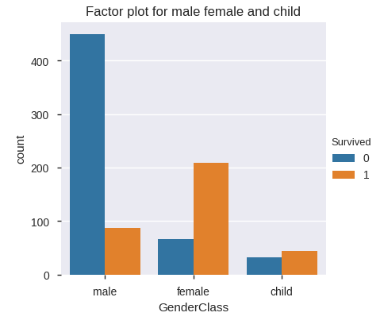

# Titanic Exploratory Data Analysis  
 
## Description
- The sinking of the __RMS Titanic__ is one of the most infamous __shipwrecks__ in history.  On __April 15, 1912__, during her maiden voyage, the Titanic sank after colliding with an iceberg, __killing 1502 out of 2224 passengers and crew__. This sensational tragedy shocked the international community and led to better safety regulations for ships.
- Resulted in the __deaths__ of __more than 1,500 people__, making it one of __history's deadliest marine disasters__ during peacetime.
- One of the reasons that the __shipwreck__ led to such loss of life was that there were __not enough lifeboats for the passengers and crew__.
- Some groups of people were more likely to survive than others, such as __women__, __children__, and the __upper-class__.

## Objective
 
- Our objectives is to __analyze__ the what sorts of people were likely to __survived__ or __died__.
## DataSet Info
- This __dataset__ consists of the __information__ about people boarding the famous __RMS Titanic__. Various variables present in the __dataset__ includes __data of age__, __sex__, __fare__, __ticket__ etc.
- The dataset comprises of __891 observations of 12 columns__.  

## Way to do Titanic EDA
- load the required packages
- load the Titanic Dataset
- Apply the statistical method to understand the data
- Apply the pandas profiling before preprocessing for better understanding of data
- Preprocessing of data
- Pandas Profiling after preprocessing
- Visualization of Data

## Visualization of Survived or Died People

- Based on Count Plot we can conclude that more people were died as compare to survived people.
- More than 500 people were died while less than 400 people survived.

## Visual representation of survived child,Male and Female

- Based on this graph, majority of male people died
- Females and Child have high probability to survive.

## Conclusion :
- Based on this Exploratory Data Analysis we are able to analyse the ratio of survived or died people.
  - __76%__ of __females__ survived.
  - __57%__ of __children__ also survived.
  - Only __16%__ of __males__ survived.
  - Also the survival rate for male is very low irrespective of the class he belongs to and the survival rate is less for all the 3rd class passengers. Almost all women in Pclass 1 and 2 survived and nearly all men in Pclass 2 and 3 died.

## ------------------------------------------------------------------------------------------------------- ##

