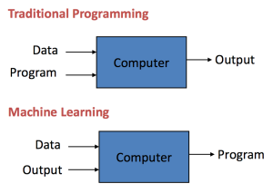

# Machine Learning With Python

__Machine Learning__ is a latest __buzzword__ floating around. It desrves to, as it is one of the most interesting __subfield__ of __Computer Science__. 
__What does Machine learning really means ?__ 
__Machine learning__ is the scientific __study__ of __algorithms__ and __statistical models__ that __computer systems__ use to effectively __perform a specific task__ without using explicit instructions, relying on patterns and inference instead. 
__Machine Learning__ is an __application of artificial intelligence__. 
__Machine learning__ algorithms build a mathematical __model__ based on sample data, known as __"training data"__, in order to make predictions or decisions without being explicitly programmed to perform the task. 
__Machine learning__ algorithms are used in a wide variety of applications, such as __email filtering__, and __computer vision__. 
 
 __Machine learning__ is uses __computational statistics__ to analyze the __pattern__, which __focuses__ on making __predictions using computers__.  
## Traditional Programming Vs Machine Learning
- A __traditional algorithm__ takes some __input__ and some __logic__ in the __form of code__ and returns the __output__. As opposed to this, a __Machine Learning__ Algorithm takes an __input__ and an __output__ and gives the some __logic__ which can then be used to work with new input to give one an output.  

## Types of Machine Learning
- Broadly, there are 3 types of Machine Learning Algorithms
 
 
 ## Repository Overview
This repository is about different Machine Learning algorithm approaches as per the industry practices.

## Table of Contents
- [House Price Prediction](#section1) 
- [Titanic Survival Analysis](#section2) 

### [House Price Prediction](./house_price_prediction)
  
- The problem is to build a model that will __predict house prices__ with a high degree of predictive accuracy given the available data. 
- The __dataset__ is the prices and features of residential houses sold.
- The dataset comprises of 1460 observations of 81 columns.
- [Link for the Jupyter notebook](./house_price_prediction/House_Price_Prediction.ipynb)

___

### [Titanic Survival Analysis](./titanic_survival_analysis)
 
 

