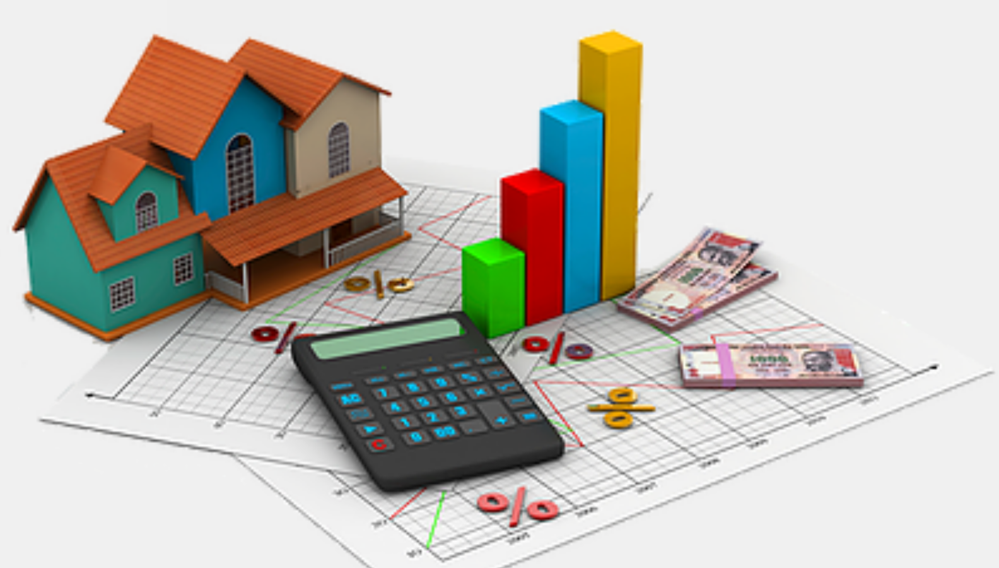
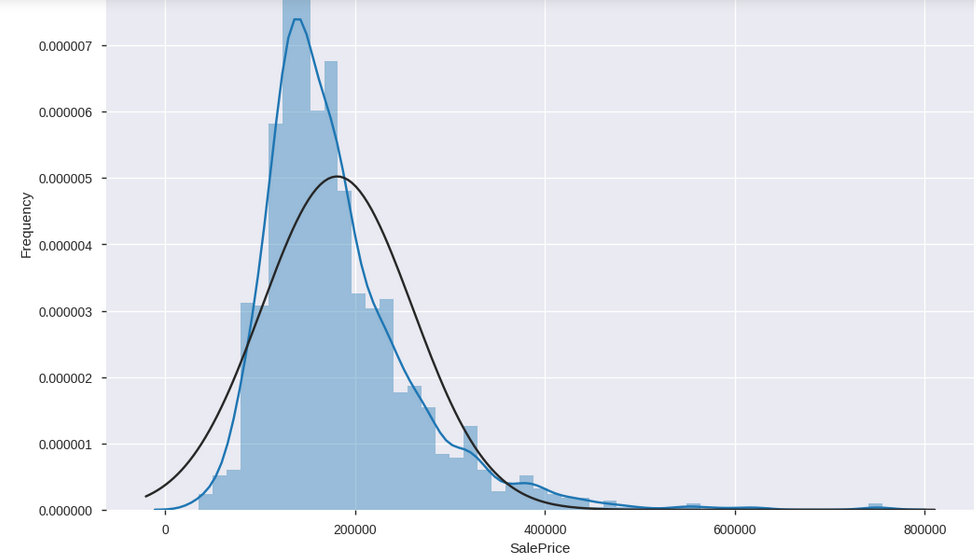
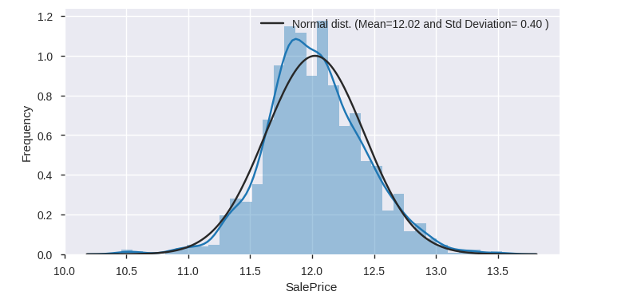
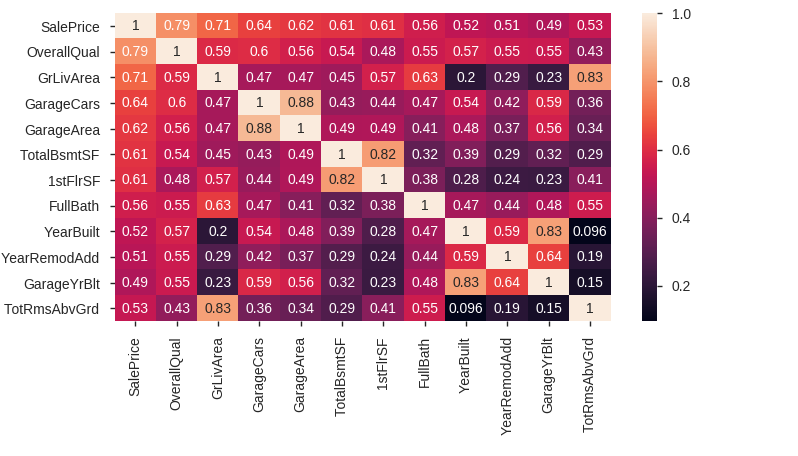
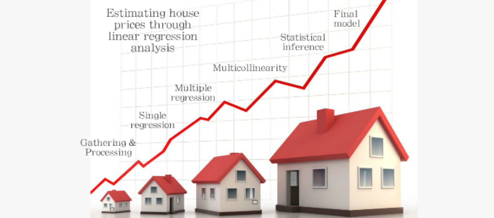
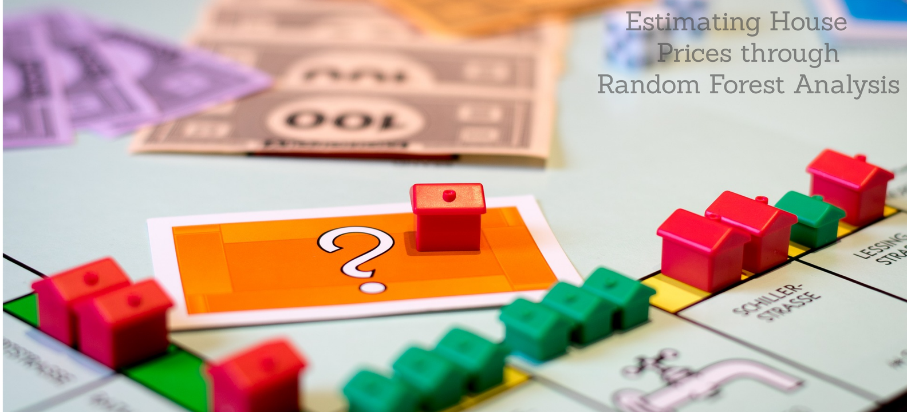

# House Price Prediction

- The __dataset__ which consists __information__ about the __house__ ,like-LotArea, Street, YearBuilt, OverallQual, Bedroom, Kitchen, other aspects and sale price of house based on previous selling.
- The dataset comprises of __1460__ observations of __81__ columns.
- Our main aim is to make a __model__ which can give us a good __prediction on the price__ of the house based on other variables. We are going to use __Linear Regression__ and __Random Forest__ for this __dataset__ and see if it gives us a __good accuracy__ or not.

## Data Distribution before and after log transormation
- Before log Transformation
  - __Target variable__ is not normally distributed and it is __right skewed__ data ,which is not following the linear regression assumptions.

- After log transformation
  - __Target Variable__ is normally distributed after log transformation applied.

## Exploratory Data Analysis 

- Once log transformation done ,I have selected numeric features to make the correlation between them.
- After correlation between the numeric features , Again i have selected more than 50% correlation features.
- I got most correlated feature ,OverallQual which is having 0.82 correlation.
- Again i have done cleaning and imputation of data.

# Training and Testing of data
- __Training__
  - During training, the machine learning system is given labeled data from a training data set.
  - The labeled training data are a large set of house information and apart from it sales price is there.  
  - During the training process, the regression model (part of the machine learning system that actually predicts house price)  learns from the training data by determining the connections between the features of an houses and its target variable. 
- __Testing__
  - During testing, the machine learning system is given unlabeled data.
  - These data are house features to predict the sales price .
  - Depending on the features of an house, the regression model predicts the sales price of house.
  - This predicted sales price is compared to the actual value of sales price to check the model prformance. 

## House Sales Price Model Using Linear and Random Regression 
- House Pricing using Linear Regression

- House Pricing using random Forest Regression

  
 ## Model evaluation
 - __Linear Regression__
  - __Root Mean Squared Error (RMSE)__ is the square root of the mean of the squared errors.
    - RMSE value is __0.14437__ for  house pricing using linear regression.
  - One more method to evaluate __linear regression__ model and that is by using the __Rsquared__ value.
    - Rsquared value is __0.87__
SO Overall __Accuracy__ for Linear regression is __87.00%__.   
- __Random Forest Regression__
  - Using random forest Accuracy got increased by 1% that is __88.00%__.

