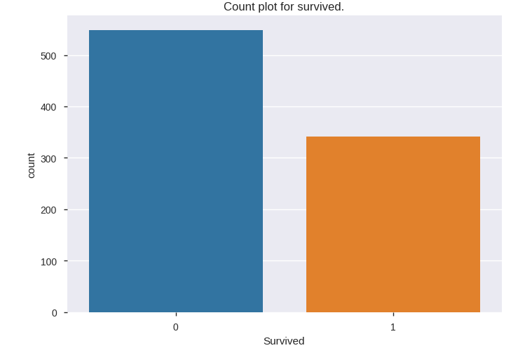
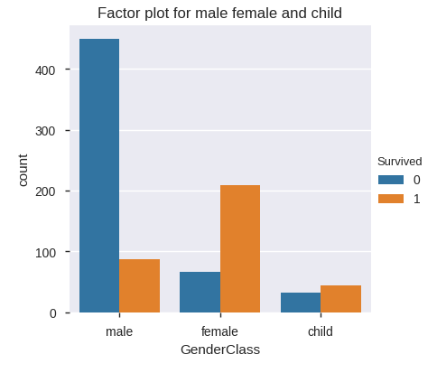
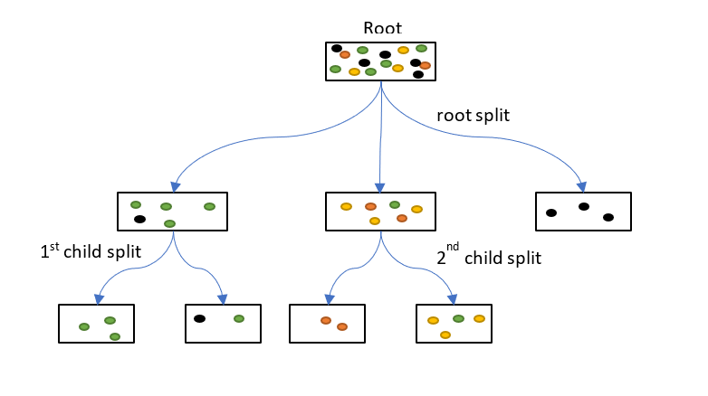
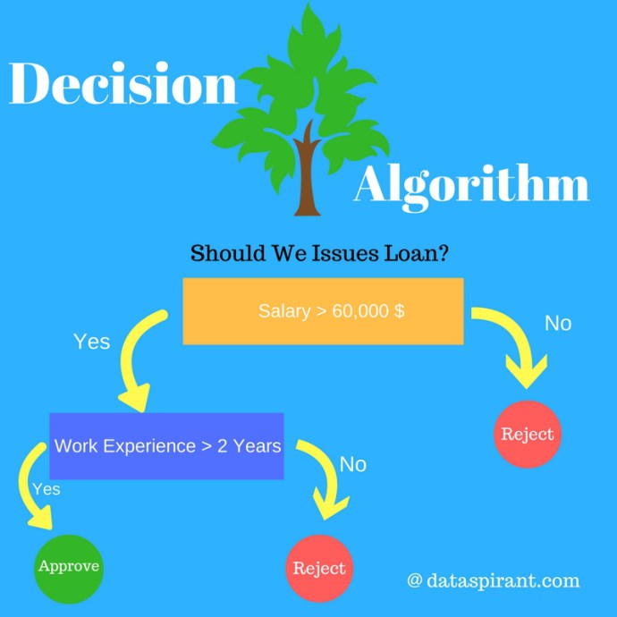
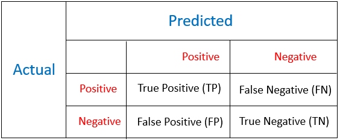

# Titanic Survival Analysis

- The __sinking of the RMS Titanic__ is one of the most infamous __shipwrecks__ in history. On __April 15, 1912__, during her maiden voyage, the Titanic sank after colliding with an iceberg, __killing 1502 out of 2224 passengers and crew__. This sensational tragedy shocked the international community and led to better safety regulations for ships.
- Resulted in the deaths of __more than 1,500 people__, making it one of __history's deadliest marine disasters__ during peacetime.
- One of the __reasons__ that the shipwreck led to such __loss of life__ was that there were __not enough lifeboats__ for the __passengers and crew__.
- Some groups of people were __more likely to survive__ than others, such as __women, children, and the upper-class.__ 

## Dataset Information
- This __dataset__ consists of the __information__ about people boarding the famous __RMS Titanic__. Various variables present in the __dataset__ includes __data of age__, __sex__, __fare__, __ticket__ etc.
- The dataset comprises of __891 observations of 12 columns__. 

## Exploratory Data Analysis
- load the required packages
- load the Titanic Dataset
- Apply the statistical method to understand the data
- Apply the pandas profiling before preprocessing for better understanding of data
- Preprocessing of data
- Pandas Profiling after preprocessing
- Visualization of Data 

## Visualization of Survived or Died People

- Based on Count Plot we can conclude that more people were died as compare to survived people.
- More than 500 people were died while less than 400 people survived. 

## Visual representation of survived child,Male and Female

- Based on this graph, majority of male people died
- Females and Child have high probability to survive. 

## Decision tree

- Decision tree is a type of __supervised learning algorithm__ (having a pre-defined target variable) that is mostly used in classification problems.
- __Decision tree__ is one of most frequently and widely used supervised machine learning algorithms that can perform both __regression and classification tasks.__ 
- The intuition behind the decision tree algorithm is simple, yet also very powerful. 
- A decision tree __split the data into multiple sets__.Then each of these sets is further split into subsets to arrive at a __decision__. 
- It is a very natural decision making process asking a series of question in a nested if then else statement.
- It works for both __categorical and continuous__ input and output variables.
- In this technique, we __split the population__ or sample into two or more homogeneous sets (or sub-populations) based on most __significant splitter / differentiator__ in input variables.
## How does a tree decide where to split?
-  __Decision Tree__ use __Entropy__ and __Information Gain__ to construct the decision tree.Based on information its decide the root node and tree splitting. 
- Gini index also play a role to decide where to split the tree.
  
# Training and Testing of data
- __Training__
  - During training, the machine learning system is given labeled data from a training data set.
  - The labeled training data are a large set of people onboarded on titanic and apart from it survival or not survival.  
  - During the training process, the Classification model (part of the machine learning system that actually predicts the Survival)  learns from the training data by determining the connections between the features of an people onboarded and its target variable. 
- __Testing__
  - During testing, the machine learning system is given unlabeled data..
  - Depending on the features of an onboarded people, the classification model predicts the survival ratio.
  - This predicted survival ratio is compared to the actual value of survival ratio to check the model prformance. 
  
## Model Evaluation Using Accracy Score and Confusion Matrix
### Accuracy Score__
- __Model Evaluation__ using __accuracy_score__ is __0.8044__. 
### Confusion Matrix

- A __confusion matrix__ is a __summary of prediction results__ on a classification problem.
- The number of __correct__ and __incorrect predictions__ are __summarized__ with count values and broken down by each class.
- 95 + 49 = 144 correct predictions & 24 + 11 = 35 false predictions.
- so __Model Evaluation__ using __Confusion Matrix__ is __0.8044__.
- [Link for the Jupyter notebook](./titanic_survival_analysis/DecisionTreesTitanicDataset.ipynb)

## ---------------------------------------------------------------------------------------------##

    

   
  
  
