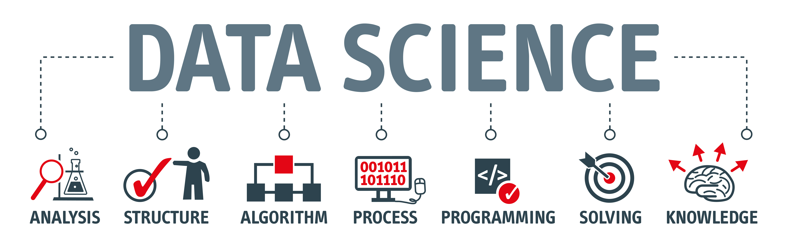
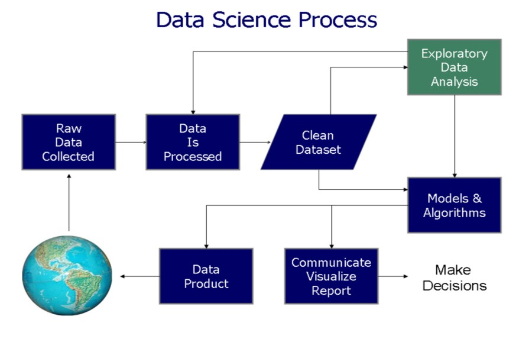
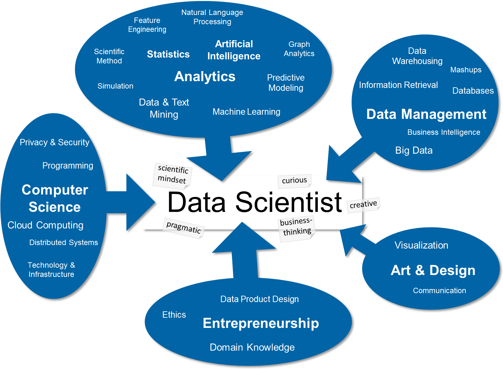
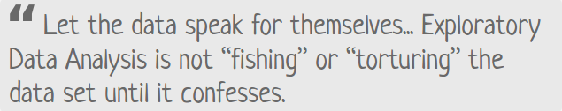

# DataScienceWithPython

   
Data Science is a latest __buzzword__ floating around. It desrves to, as it is one of the most interesting subfield of Computer Science. 
__What does Data Science really means?__ 
 
__Data science__ is a broad field that refers to the collective processes, theories, concepts, tools and technologies that enable the review, analysis and extraction of valuable knowledge and information from __raw data__. 
__Data science__ is formerly known as __datalogy__. 
## The Pillars of Data Science Expertise
- Business domain
- Statistics and probability
- Computer science and software programming
- Written and verbal communication  
## Data Science Goals and Deliverables
- Prediction (predict a value based on inputs)
- Classification (e.g., spam or not spam)
- Recommendations (e.g., Amazon and Netflix recommendations)
- Pattern detection and grouping (e.g., classification without known classes)
- Anomaly detection (e.g., fraud detection)
- Recognition (image, text, audio, video, facial, …)
- Actionable insights (via dashboards, reports, visualizations, …)
- Automated processes and decision-making (e.g., credit card approval)
- Scoring and ranking (e.g., FICO score)
- Segmentation (e.g., demographic-based marketing)
- Optimization (e.g., risk management)
- Forecasts (e.g., sales and revenue) 

Each of these is intended to address a specific goal and/or solve a specific problem. The real question is which goal, and whose goal is it?

__For example__, a data scientist may think that her goal is to create a high performing prediction engine. The business that plans to utilize the prediction engine, on the other hand, may have the goal of increasing revenue, which can be achieved by using this prediction engine. 
## The Data Science Process
- Data acquisition, collection, and storage
- Discovery and goal identification (ask the right questions)
- Access, ingest, and integrate data
- Processing and cleaning data (munging/wrangling)
- Initial data investigation and exploratory data analysis (EDA)
- Choosing one or more potential models and algorithms
- Apply data science methods and techniques (e.g., machine learning, statistical modeling, artificial intelligence, …)
- Measuring and improving results (validation and tuning)
- Delivering, communicating, and/or presenting final results
- Business decisions and/or changes are made based on the results
- Repeat the process to solve a new problem  
Here is a diagram representing a simpler version of this process. 
  
## Data Scientists Role
__Data Scientist__ is the one, which make sense out of all this huge data and requires many different roles. Each of these roles brings different critical skills and insights to make this process of transforming huge pile of Data to __valuable insights__.
 

## Repository Overview
This repository is about Exploratory Data Analysis and different types of Machine Learning algorithm approaches as per the industry practices.
## Sub-Field Of Data Science
- [Exploratory Data Analyisis](#section1) 
- [Machine Learning](#section2)  

___

### [Exploratory Data Analysis](./ExploratoryDataAnalysis)
 
__Exploratory Data Analysis (EDA)__ consists of techniques that are typically applied to gain insight into a dataset before doing any formal modelling 

- EDA helps us to uncover the underlying structure of the dataset, identify important variables, detect outliers and anomalies, and test underlying assumptions.
- EDA can also point out missing data as may be relevant to building desired models. 

